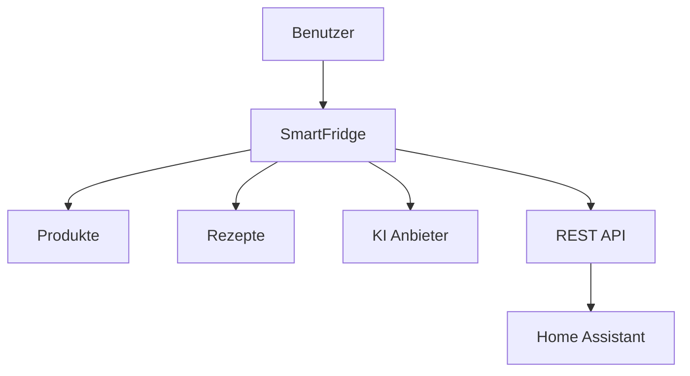

# 🧊 SmartFridge

Willkommen bei der offiziellen Dokumentation von SmartFridge.

SmartFridge ist eine moderne Open-Source-Webanwendung zur Verwaltung von Lebensmitteln, Rezepten und KI-gestützter Küchenunterstützung.

---

## ✨ Features

-   :material-fridge-outline: __Lebensmittelverwaltung__

    ---

    Verwalte Produkte, Mengen und Ablaufdaten zentral an einem Ort.

-   :material-robot-outline: __KI-Unterstützung__

    ---

    Generiere Rezepte und Vorschläge mit OpenAI, Gemini oder Ollama.

-   :material-cellphone: __PWA Unterstützung__

    ---

    Nutze SmartFridge auf Smartphone, Tablet oder Desktop wie eine normale App.

-   :material-home-assistant: __Home Assistant__

    ---

    Integration über HACS inklusive eigener Dashboard-Karte.

-   :material-api: __REST API__

    ---

    Greife über eine einfache API auf deine Daten zu.

-   :material-account-group-outline: __Mehrbenutzer__

    ---

    Unterstützung für mehrere Benutzer und persönliche Daten.

---

## 🧠 Unterstützte KI-Anbieter

=== "OpenAI"

    - GPT Modelle
    - Cloudbasiert
    - API-Key erforderlich

=== "Google Gemini"

    - Gemini API
    - Schnelle Antworten
    - API-Key erforderlich

=== "Ollama"

    - Lokale KI Modelle
    - Datenschutzfreundlich
    - Keine Cloud notwendig

---

## 🔄 Systemübersicht

---

## 📚 Dokumentation

Nutze die Navigation auf der linken Seite, um die verschiedenen Bereiche der Dokumentation zu öffnen.

!!! tip "Empfohlen"

    Neue Nutzer sollten mit der Installationsanleitung beginnen.

---

## 🔗 Links

| Projekt | Link |
|---|---|
| SmartFridge PWA | `github.com/henristr/SmartFridgePWA` |
| Android App | `github.com/henristr/SmartFridgeAndroid` |
| Home Assistant | `github.com/henristr/FridgeAssistant` |

---

## ❤️ Open Source

SmartFridge ist ein Open-Source-Projekt und wird aktiv weiterentwickelt.
