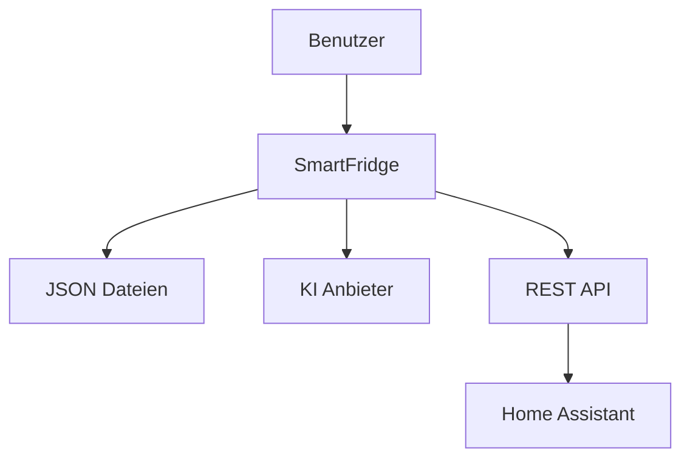

# SmartFridge Installation

!!! info "Systemvoraussetzungen"

    Für SmartFridge werden folgende Programme benötigt:

    - Python 3.9 oder neuer
    - Git

---

## 🚀 Installation & Setup

### 1. Repository klonen

```bash
git clone https://github.com/henristr/SmartFridgePWA.git
```

### 2. In den Projektordner wechseln

```bash
cd SmartFridgePWA
```

### 3. Virtuelle Umgebung erstellen (empfohlen)

```bash
python -m venv venv
```

### 4. Virtuelle Umgebung aktivieren

=== "Windows"

    ```bash
    venv\Scripts\activate
    ```

=== "Linux / macOS"

    ```bash
    source venv/bin/activate
    ```

### 5. Abhängigkeiten installieren

```bash
python -m pip install -r requirements.txt
```

---

## 🛫 Start der Anwendung

```bash
python app.py
```

Die Anwendung läuft anschließend standardmäßig unter:

```text
http://localhost:8080
```

---

## 🔐 Standard Login

!!! warning "Wichtig"

    Der Standard-Login sollte nach der Installation geändert werden.

| Benutzername | Passwort |
| ------------ | -------- |
| admin        | admin    |

Die Zugangsdaten können in der `app.py` angepasst werden.

```python title="app.py" linenums="1" hl_lines="1"
return {"admin": {"password": "admin", "diet": ""}}
```

---

## ⚙️ KI-Konfiguration

!!! info "Ersteinrichtung"

    Nach dem ersten Login muss ein KI-Anbieter eingerichtet werden.

### Einrichtung

1. Als Admin anmelden
2. Das Administrationsmenü öffnen
3. KI-Anbieter auswählen
4. API-Key eintragen
5. Modell auswählen

### Unterstützte Anbieter

=== "Google Gemini"

    - Gemini API
    - Cloudbasierte KI

=== "OpenAI"

    - GPT Modelle
    - API-Key erforderlich

=== "Ollama"

    - Lokale KI
    - Kein Cloudanbieter notwendig

---

## 📲 PWA & Mobile Nutzung

!!! tip "Progressive Web App"

    SmartFridge kann auf Smartphones wie eine normale App installiert werden.

### Installation

1. Die URL der SmartFridge-Installation im Browser öffnen
2. Das Browser-Menü öffnen
3. **„Zum Home-Bildschirm hinzufügen“** auswählen
4. Die App erscheint anschließend im App-Drawer bzw. Home-Bildschirm

### Android App

Android-Nutzer können zusätzlich die native Android-Version verwenden:

```text
https://github.com/henristr/SmartFridgeAndroid
```

---

## 🛜 API Nutzung

!!! example "REST API"

    SmartFridge besitzt eine einfache REST API zum Abrufen von Produktdaten.

### API-Key generieren

1. Als Admin anmelden
2. Den Bereich **API** öffnen
3. Auf **Generieren** klicken
4. Den API-Key kopieren

### API Anfrage

=== "Request"

    ```http
    GET https://deine-installation.com/api/products
    ```

=== "Header"

    | Header | Wert |
    |---|---|
    | API-Key | dein-key |

=== "cURL Beispiel"

    ```bash
    curl -X GET https://deine-installation.com/api/products \
      -H "API-Key: dein-key"
    ```

---

## 🏠 Home Assistant Integration

!!! tip "Home Assistant"

    SmartFridge unterstützt Home Assistant über HACS.

### 1. Repository zu HACS hinzufügen

```text
https://github.com/henristr/FridgeAssistant
```

### 2. Integration installieren

1. In HACS nach **FridgeAssistant** suchen
2. Die Integration installieren
3. Home Assistant neu starten

### 3. Integration hinzufügen

1. Geräte & Dienste öffnen
2. Integration hinzufügen auswählen
3. FridgeAssistant auswählen
4. API-Endpunkt eintragen
5. API-Key eintragen
6. Benutzer auswählen

### 4. Dashboard Ressource hinzufügen

Pfad:

```text
/fridge_assistant_static
```

Ort:

```text
Einstellungen → Dashboards → ⋮ → Ressourcen
```

### 5. Karte hinzufügen

Danach kann die FridgeAssistant-Karte im Dashboard hinzugefügt werden.

---

## 📂 Dateistruktur & Daten

!!! info "Lokale Speicherung"

    Alle Daten werden lokal als JSON-Dateien gespeichert.

Die Dateien werden beim ersten Start automatisch erstellt.

| Datei            | Beschreibung                        |
| ---------------- | ----------------------------------- |
| `produkte.json`  | Kühlschrank-Inhalt                  |
| `users.json`     | Benutzerkonten und Passwörter       |
| `rezepte.json`   | Generierte und gespeicherte Rezepte |
| `ai-config.json` | KI-Konfiguration                    |
| `config.py`      | Alternative zur `ai-config.json`    |

??? danger "Dateien löschen"

    Das Löschen dieser Dateien setzt Daten zurück.

---

## 🔄 Datenfluss



---

## ❗ Sicherheitshinweis

!!! danger "Passwörter"

    Benutzer und Passwörter werden aktuell unverschlüsselt in der `users.json` gespeichert.

    Deshalb sollte SmartFridge nicht ungeschützt öffentlich erreichbar sein.

---

## 🌐 Reverse Proxy Beispiele

=== "Caddy"

    ```caddy
    smartfridge.example.com {
        reverse_proxy localhost:8080
    }
    ```

=== "Nginx"

    ```nginx
    server {
        server_name smartfridge.example.com;

        location / {
            proxy_pass http://localhost:8080;
        }
    }
    ```

---

## 🧪 Unterstützte Plattformen

| Plattform    | Unterstützt |
| ------------ | ----------- |
| Windows      | ✅          |
| Linux        | ✅          |
| macOS        | ✅          |
| Raspberry Pi | ✅          |

---

## ❤️ Projekt

SmartFridge ist ein Open-Source-Projekt zur Verwaltung von Lebensmitteln, Rezepten und KI-gestützter Küchenunterstützung.
